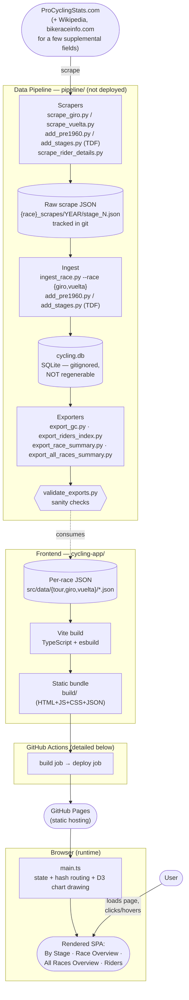
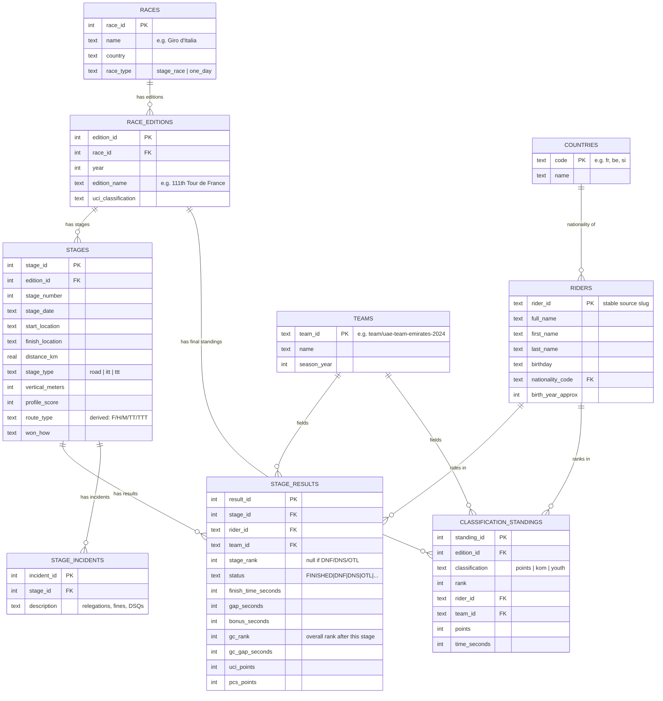
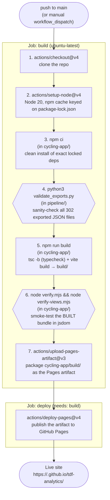

# Architecture

This document is a visual companion to [`ai-context.md`](ai-context.md), which has the
full prose detail. Here: a system architecture diagram, the data model, and the CI/CD
flow, each with a short note per block/step.

---

## System Architecture



### Block notes

- **PCS / Wikipedia / bikeraceinfo.com** — external, uncontrolled data sources. PCS
  (ProCyclingStats) is authoritative for stage results, GC standings, and points; Wikipedia
  and bikeraceinfo.com fill a handful of gaps (official total race distance, some GC winner
  times) where PCS's own numbers are unreliable or absent for historical editions.

- **Scrapers** (`scrape_giro.py`, `scrape_vuelta.py`, `add_pre1960.py`/`add_stages.py` for
  TDF, plus one-off scripts like `scrape_rider_details.py`, `scrape_vuelta_gc_pages.py`,
  `scrape_kom_points.py`) — fetch PCS pages and write raw per-stage JSON. PCS blocks plain
  HTTP scraping with a Cloudflare challenge for live/recent data, so in-progress-race
  scraping goes through a browser + local save-server instead (see `ai-context.md`'s
  "Scraping a live/in-progress race" section).

- **Raw scrape JSON** (`{race}_scrapes/YEAR/stage_N.json`) — the scraper's direct output,
  one file per stage. Tracked in git (this used to be gitignored with the only copy on one
  machine — a past near-loss that's now fixed). This is the only re-derivable source if
  `cycling.db` is ever lost.

- **Ingest** (`ingest_race.py --race {giro,vuelta}`, `add_pre1960.py`/`add_stages.py` for
  TDF) — parses the raw scrape JSON and writes rows into `cycling.db`. Re-ingesting a year
  deletes and re-creates that edition atomically, preserving fields (`vertical_meters`,
  `profile_score`) that come from separate scrapers, not the main stage scrape.

- **cycling.db** — the single SQLite database backing all three races (see Data Model
  below). Gitignored and **not regenerable** in general — many historical years' raw PCS
  pages no longer exist in the same form. Back up with `pipeline/db_backup.py` before any
  risky operation.

- **Exporters** (`export_gc.py`, `export_riders_index.py`, `export_race_summary.py`,
  `export_all_races_summary.py`) — read `cycling.db` (+ a few JSON supplements like
  `sprint_points.json`, `*_gc_winner_times.json`) and write the compact per-race JSON files
  the frontend actually bundles. All are `--race`-parameterized except
  `export_all_races_summary.py`, which is TDF-only (predates the other races).

- **validate_exports.py** — a post-export sanity check (not a data source): catches
  decreasing cumulative point totals, malformed stage sequences, and KOM-total drift
  against a reference. Runs locally after any export, and again in CI before every build so
  a bad export can never reach production.

- **Per-race JSON** (`cycling-app/src/data/{tour,giro,vuelta}/*.json`) — the frontend's only
  input. Vite discovers these via wildcard globs (`./data/*/gc_by_stage_*.json` etc.), so
  adding a new race is just a new `RACES` registry entry + a new `src/data/<slug>/`
  directory — no code changes to the loading logic.

- **Vite build** — compiles `main.ts` (TypeScript) and bundles it with the JSON data files
  into a static site. Per-year `gc_by_stage_*.json` files are emitted as separate lazily
  `fetch()`-loaded assets, not bundled into the main JS — only their hashed URLs are
  eagerly imported (`?url` imports), so the initial page load stays small (~76 KB gzipped)
  regardless of how many years/races exist.

- **Static bundle** (`build/`) — plain HTML/CSS/JS/JSON, servable from anywhere. No backend,
  no server-side code, no framework runtime beyond D3.

- **GitHub Actions / GitHub Pages** — see the CI/CD Flow diagram below for the exact steps.

- **main.ts (runtime)** — a single TypeScript module holding all app state (current
  race/year/metric/selection), D3 chart-drawing functions for all four views, and hash-based
  routing so every view is a shareable URL. Per-year datasets are fetched on demand and
  LRU-cached (max 6) in the browser, not preloaded.

- **User** — interacts entirely client-side after the initial page load; race/year
  switches, filters, and the Riders search all `fetch()` additional JSON on demand rather
  than reloading the page.

---

## Data Model

`cycling.db` is one SQLite database shared by all three races, distinguished by
`races.race_id`. Every table below actually exists in the live DB; note that `riders`
has three columns (`first_name`, `last_name`, `birthday`) added by an `ALTER TABLE`
migration that `schema.sql` itself doesn't reflect — the live schema (shown here) is
the accurate one.



### Conceptual hierarchy

```
Race                              (races — "Tour de France", "Giro d'Italia", "Vuelta a España")
└── Race Edition                  (race_editions — one year's running, e.g. "2026 Giro d'Italia")
    ├── Stage                     (stages — one day's race, or the whole thing for a one-day race)
    │   ├── Stage Result          (stage_results — one rider × one stage: rank, time, GC standing that day)
    │   │   ├── → Rider           (riders)
    │   │   └── → Team            (teams — team identity is re-created every season)
    │   └── Stage Incident        (stage_incidents — jury rulings that don't fit numeric columns)
    └── Classification Standing   (classification_standings — final points/KOM/youth jersey, per rider)
        ├── → Rider
        └── → Team

Rider  → Country                  (riders.nationality_code → countries.code)
```

### Notes

- **General classification (GC) is not a separate table.** A rider's overall standing
  after each stage lives directly on that stage's `stage_results` row (`gc_rank`,
  `gc_gap_seconds`) — the final GC placing is just the last stage's row. This is why the
  per-stage GC data-fabrication bug (see `ai-context.md`'s "Vuelta & Giro per-stage GC
  standings" section) was so consequential: it corrupted the one place GC history lives.
- **`classification_standings`** only holds the *secondary* jerseys (points/KOM/youth)
  because GC is already covered by `stage_results`. `classification='youth'` is only
  populated for the TDF — Giro/Vuelta's pipelines never captured it (see the frontend's
  `hasYouth` flag).
- **Team identity resets every season** (`team_id` embeds the year, e.g.
  `team/uae-team-emirates-2024`) because sponsor names change constantly in pro cycling —
  there's no stable "team franchise" concept to model.
- **`rider_id` is a stable slug** (e.g. `rider/tadej-pogacar`) sourced from PCS's own URLs,
  used as the primary key across all three races and every era — this is what makes the
  cross-race rider detail page possible (one rider ID, looked up independently in each
  race's index).
- **Indexes** exist on the hot lookup paths: `stage_results(stage_id)`,
  `stage_results(rider_id)`, `stage_results(team_id)`, `stages(edition_id)`,
  `classification_standings(edition_id, classification)`.

---

## CI/CD Flow

Trigger: every push to `main`, or a manual `workflow_dispatch`. The `concurrency` group
(`pages`, `cancel-in-progress: true`) means a new push cancels any in-flight deploy for an
older commit rather than letting them race each other.



### Step notes

1. **Checkout** — standard first step; nothing else in the job can run without the repo
   contents.
2. **Setup Node** — pins Node 20 and restores npm's cache keyed on
   `cycling-app/package-lock.json`, so `npm ci` doesn't re-download every dependency on
   every run.
3. **`npm ci`** — installs exactly what's in `package-lock.json` (unlike `npm install`, it
   never modifies the lockfile and fails if it's out of sync with `package.json`) — the
   right choice for CI reproducibility.
4. **`validate_exports.py`** — runs against whatever is currently committed in
   `cycling-app/src/data/`, *before* the build step touches anything. This is a gate on the
   data itself, independent of the frontend code: a bad export can fail CI even if the
   TypeScript compiles and the app renders.
5. **`npm run build`** — `tsc -b` type-checks the whole frontend (a type error fails the
   build here, before anything is deployed), then `vite build` produces the static bundle
   in `cycling-app/build/`.
6. **Smoke tests** (`verify.mjs`, `verify-views.mjs`) — these run against the *built*
   bundle in a `jsdom` environment, not the TypeScript source, because `main.ts` uses
   Vite's `import.meta.glob()` which only resolves at build time. `verify.mjs` checks the
   default stage-chart view renders with plausible data volumes; `verify-views.mjs` boots
   fresh `jsdom` instances at several deep-link hashes (stage, riders, rider detail,
   all-races, overview) to catch view-specific regressions the default-view check would
   miss.
7. **Upload artifact** — packages `cycling-app/build/` for the `deploy` job to consume;
   this is the GitHub Pages-specific artifact format (not a generic build artifact).
8. **Deploy** — a separate job (`needs: build`) so it only runs if every build/validate/test
   step above succeeded; publishes the artifact to GitHub Pages and exposes the live URL as
   the job's `page_url` output.

If any step 1-6 fails, the workflow stops there — nothing is ever uploaded or deployed from
a build that failed validation, type-checking, or the smoke tests.
