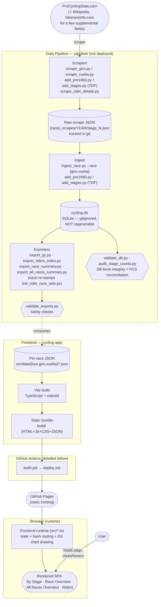
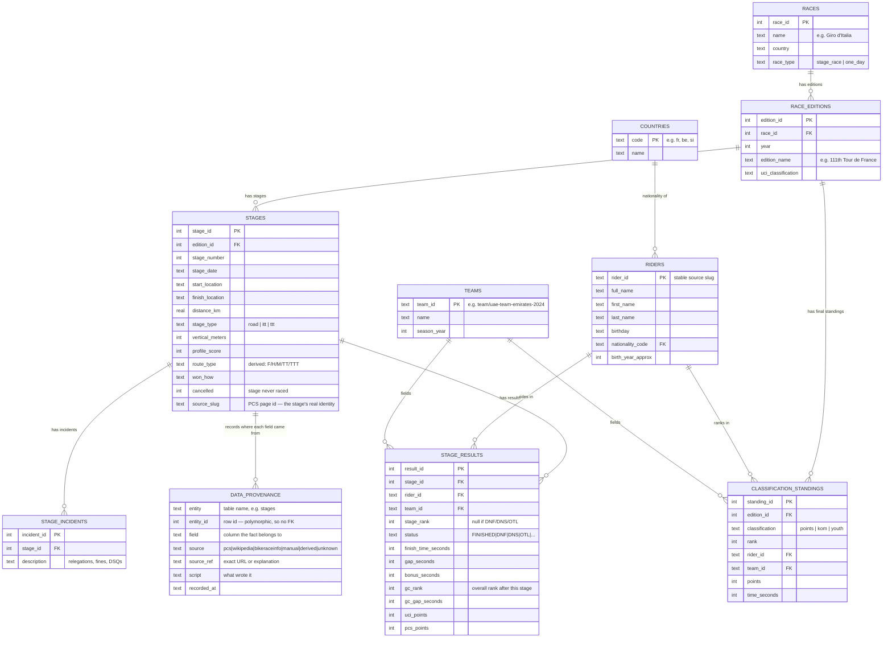
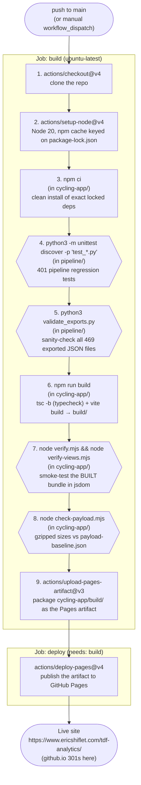

# Architecture

This document is a visual companion to [`ai-context.md`](ai-context.md), which has the
full prose detail. Here: a system architecture diagram, the data model, and the CI/CD
flow, each with a short note per block/step.

---

## System Architecture



### Block notes

- **PCS / Wikipedia / bikeraceinfo.com** — external, uncontrolled data sources. PCS
  (ProCyclingStats) is authoritative for stage results, GC standings, and points; Wikipedia
  and bikeraceinfo.com fill a handful of gaps (official total race distance, some GC winner
  times) where PCS's own numbers are unreliable or absent for historical editions.

- **Scrapers** (`scrape_giro.py`, `scrape_vuelta.py`, `add_pre1960.py`/`add_stages.py` for
  TDF, plus one-off scripts like `scrape_rider_details.py`, `scrape_vuelta_gc_pages.py`,
  `scrape_kom_points.py`) — fetch PCS pages and write raw per-stage JSON. PCS blocks plain
  HTTP scraping with a Cloudflare challenge for live/recent data, so in-progress-race
  scraping goes through a browser + local save-server instead (see `ai-context.md`'s
  "Scraping a live/in-progress race" section). `scrape_vuelta.py`/`scrape_giro.py`
  `scrape_year()` derives each stage's file number from the PCS slug (`stage-12` → 12,
  fixed 2026-07-25) rather than its position in the discovered-stage list — the old
  positional numbering silently shifted every later stage down by one whenever a single
  probe failed mid-scrape, which is how the 2020 Vuelta lost Stage 12 (Alto de l'Angliru)
  for years without anyone noticing. A gap in saved stage numbers now prints a warning.
  Separately, `scrape_vuelta.py`'s row parser can silently leave `gc_pos`/`gc_lag` blank
  for an entire stage when the results table has no `GC`/`Timelag` column — confirmed on
  a team-time-trial stage (2025 Vuelta Stage 5); not yet fixed at the source, see
  ai-context.md lesson 7 under "Lessons learned from Giro 2026 scraping".

- **Raw scrape JSON** (`{race}_scrapes/YEAR/stage_N.json`) — the scraper's direct output,
  one file per stage. Tracked in git (this used to be gitignored with the only copy on one
  machine — a past near-loss that's now fixed). This is the only re-derivable source if
  `cycling.db` is ever lost. Each row is a 15-field list parsed via the shared
  `race_common.StageRow` schema (added 2026-07-25) instead of raw positional indexing — a
  malformed row now raises a clear error instead of silently corrupting or dropping data.

- **Ingest** (`ingest_race.py --race {giro,vuelta}`, `add_pre1960.py`/`add_stages.py` for
  TDF) — parses the raw scrape JSON and writes rows into `cycling.db`. Re-ingesting a year
  deletes and re-creates that edition atomically, preserving fields (`vertical_meters`,
  `profile_score`) that come from separate scrapers, not the main stage scrape.
  `add_stages.py` (TDF) additionally gates on `detect_name_swaps.py`'s bib-consistency
  check before touching anything — it aborts if any bib maps to more than one rider
  identity anywhere in the on-disk year, catching the PCS-side "adjacent-row swap"
  rendering artifact (ai-context.md's "Scraping a live/in-progress race" section) before
  it reaches the DB.

- **cycling.db** — the single SQLite database backing all three races (see Data Model
  below). Gitignored and **not regenerable** in general — many historical years' raw PCS
  pages no longer exist in the same form. Back up with `pipeline/db_backup.py` before any
  risky operation.

- **Exporters** (`export_gc.py`, `export_riders_index.py`, `export_race_summary.py`,
  `export_all_races_summary.py`) — read `cycling.db` (+ a few JSON supplements like
  `{race}_sprint_points.json`, `{race}_gc_winner_times.json`) and write the compact per-race JSON files
  the frontend actually bundles. All are `--race`-parameterized except
  `export_all_races_summary.py`, which is TDF-only (predates the other races). Only
  `export_gc.py` takes `--year YYYY` to scope a run to one edition — it must be passed as
  its own flag (`--year 2020`), not a bare positional, which is rejected with an error as
  of 2026-07-25 (previously silently ignored, causing every year to re-export).
  `export_riders_index.py`/`export_race_summary.py` have no such flag and never will: each
  writes one combined cross-year file, so a single-year fix still touches every year's
  entry in the diff — that's expected, not a bug.

  Every exporter that writes a `riders_index.json` calls `link_rider_race_sets.stamp()`
  on its way out. That post-pass writes the cross-race `x` bitmask the rider detail page
  reads to decide which OTHER indexes it can skip, and rewriting an index drops it — so
  it is re-applied automatically rather than left as a step to remember.
  `validate_exports.py` still checks it, as a backstop for a hand-edited file or a new
  writer that forgets. See `ai-context.md`, "The rider detail page stopped loading all
  five indexes".

- **coverage.py** — a *report*, not a check, and the only thing here that answers "where
  are the holes?" rather than "is this value wrong?". Per race set and year, which fields
  are still missing, ranked by values missing rather than percentage. It never fails a
  build; its exclusions (cancelled stages, DNF finish times, the fields PCS has no source
  for) are what keep it readable, and each one is pinned by `test_coverage.py`.

- **validate_exports.py** — a post-export sanity check (not a data source): catches
  decreasing cumulative point totals, malformed stage sequences, and KOM-total drift
  against a reference. Runs locally after any export, and again in CI before every build so
  a bad export can never reach production.

- **validate_db.py / audit_stage_counts.py** — integrity checks on the *database*, where
  `validate_exports.py` only sees the JSON that was already written. `validate_db.py`
  catches numbering gaps, duplicate or missing `source_slug`, orphaned provenance, and
  distances copied from a neighbouring stage; ERROR exits 1, WARN reports a known upstream
  limit. `audit_stage_counts.py` reconciles each edition against PCS's own published stage
  list **by route**, which is the only way to catch an edition that simply ends early or
  never got a split day's second half — those are numbered 1..N with no gap and look
  perfectly healthy. Its `--confirm-slugs` mode also records provenance for every slug
  that list confirms. Run both around any data change; they exist because a day of
  corruption was once invisible until someone eyeballed a chart.

- **Per-race JSON** (`cycling-app/src/data/{tour,giro,vuelta,classics,gravel}/*.json`) — the
  frontend's only input. Vite discovers these via wildcard globs
  (`./data/*/gc_by_stage_*.json` etc.), so adding a new race is just a new `RACES`
  registry entry + a new `src/data/<slug>/` directory — no code changes to the loading
  logic. Neither `classics/` nor `gravel/` has an `all_races_summary.json`; their
  `RaceConfig.hasAllYears` flag hides that view rather than rendering an empty chart.

- **One-day classics** (`ingest_classics.py`, `export_classics.py`) — 11 independent
  `race_type='one_day'` races in the DB, aggregated at export time into a single
  frontend race whose "stages" are those races, ordered by `stage_date`. This is a
  separate path from `export_gc.py` on purpose: that script assumes one edition = one
  race with N stages, and the classics invert it (N editions of N races = one displayed
  season). See ai-context.md's "One-day classics" for the rules, including why
  `finalRank` is a best-of-season aggregate and why cancelled races are kept.

- **Grand Tour scrapers** (`scrape_race.py`, `scrape_stage_info.py`,
  `check_gc_times.py`) — one implementation each, serving both the Giro and the
  Vuelta, selected with `--race`. These were six files in three 85–95% identical
  pairs; everything that differed was the PCS URL slug, the output directory and
  the words printed. `scrape_giro.py` and friends survive as thin wrappers so
  every recipe keeps working. The win is not line count: the parsing is
  fixture-tested (`test_scrapers.py`), but only ever through the Vuelta copy, so
  the Giro's identical 584 lines were untested and a fix applied to one and not
  the other would have failed nothing.

- **Gravel** (`resolve_gravel_courses.py`, `scrape_athlinks.py`,
  `link_gravel_riders.py`, `ingest_gravel.py`, `export_gravel.py`) — the same aggregate
  shape as the classics: 6 independent `race_type='gravel'` races combined at export
  time. Three things make it a genuinely different path rather than a copy. The source
  is the Athlinks results API, not PCS, which does not cover these races at all. Which
  Athlinks *course* holds each edition's top-level men's field is resolved once into a
  reviewed `_course_map.json`, because Athlinks renames courses yearly and a wrong pick
  yields a plausible fictional race rather than an error. And rider identity has no id
  to join on, so `link_gravel_riders.py` decides by name — under a strict rule, with its
  evidence written down — which is what puts Peter Stetina's gravel results on the same
  page as his Tours. See ai-context.md's "Gravel".

- **Vite build** — compiles `main.ts` (TypeScript) and bundles it with the JSON data files
  into a static site. Per-year `gc_by_stage_*.json` files are emitted as separate lazily
  `fetch()`-loaded assets, not bundled into the main JS — only their hashed URLs are
  eagerly imported (`?url` imports), so the initial page load stays small (~76 KB gzipped)
  regardless of how many years/races exist.

- **Static bundle** (`build/`) — plain HTML/CSS/JS/JSON, servable from anywhere. No backend,
  no server-side code, no framework runtime beyond D3.

- **GitHub Actions / GitHub Pages** — see the CI/CD Flow diagram below for the exact steps.

- **Frontend runtime (`cycling-app/src/`)** — split into modules (2026-08-01; previously one
  2,900-line `main.ts`) along the boundaries the file's own `// ─── Section ───` comments
  already implied. Per-year datasets are fetched on demand and LRU-cached (max 6) in the
  browser, not preloaded. Pure reorganization — same Vite build, no behavior change.

  | File | Role |
  |---|---|
  | `d3.ts` | Modular d3 imports re-exported as a `d3` namespace (keeps `d3.select(...)` call sites unchanged) |
  | `dom.ts` | Every module-level `document.getElementById(...)` element ref, resolved once |
  | `utils.ts` | Generic helpers with no app dependency (`debounce`) |
  | `raceRegistry.ts` | `RaceId`, `RaceConfig`, the `RACES` registry, and the `URLS_BY_RACE`/`ALL_RACES_BY_RACE` glob-discovery of per-race data files |
  | `state.ts` | The shared **mutable state object** — see note below — plus `raceConfig()` |
  | `formatters.ts` | Time/gap string formatting, route-type colors, difficulty score |
  | `riderDisplay.ts` | `displayName`, nationality flag rendering (prototype-cloned per nationality), and `foldForSearch`/`searchHaystack` accent folding — shared across 3+ views |
  | `tooltip.ts` | Generic tooltip positioning/show/hide (the rider-hover tooltip content itself lives in `stageChart.ts` — too coupled to that view's state to be a leaf) |
  | `jerseyIcons.ts` | Jersey SVG builders, per-classification win-year lookups (memoized), the per-race jersey capability helpers, and `RIDERS_WITH_REVOKED_RESULTS` |
  | `dataLoading.ts` | Pure fetch + LRU cache for per-year datasets (`getDataset`) |
  | `riderIndexData.ts` | Loads/caches the compact `riders_index.json` per race; dedupes concurrent loads, builds `constituents` lazily, and decodes the cross-race `x` bitmask that `crossRaceFor()` answers from |
  | `hashRouting.ts` | `computeHash`/`updateHash` only — `applyHash()` stays in `main.ts` (see below) |
  | `views/overview.ts` | Race Overview (per-stage distance/elevation/difficulty bars) |
  | `views/allRaces.ts` | All Races Overview (4-panel cross-year comparison) |
  | `views/stageChart.ts` | By Stage bump chart + its legend and Team/Nation filters — the app's biggest, most state-coupled view, kept as one file since ranking computation, rendering, legend, and filters are genuinely one unit |
  | `views/stageTable.ts` | By Stage spreadsheet grid (riders x stages), its per-column colour ramp, and — for aggregate races only — the Top 10 / Top 20 / All / Nation row filters in the column to its left |
  | `views/riders.ts` | Riders grid: search/filter, and the merged-index cache — which tracks which races have been **folded in**, not just which are selected, so the grid can draw before every index has landed |
  | `views/riderDetail.ts` | Cross-race rider career chart (446 lines — was the single largest function in the old `main.ts`) |
  | `views/classicsHistory.ts` | Race History small multiples for either aggregate race set — classics or gravel (one panel per race across its own lifetime) |
  | `main.ts` | Orchestration only: `init()`, `wireControls()`, `setRace()`, `switchView()`, `loadDataset()`, `applyHash()` — the last two stay here rather than in `dataLoading.ts`/`hashRouting.ts` because both call into nearly every view module to trigger redraws. `switchView(view, { draw: false })` swaps the chrome without drawing, used only by a `#riders/<slug>` deep link so the grid does not start loading every race's index ahead of a rider detail |

  **Shared mutable state:** ES modules can't reassign an imported `let` binding from outside
  the module that declared it, so every field that used to be a bare `let currentYear = ...`
  now lives as a property on one exported `state` object (`state.currentYear`); every module
  does `state.foo = x` instead. Only `state` itself is ever imported, never reassigned, which
  keeps this valid — the standard pattern for sharing mutable state across plain-TS files
  without a framework.

  **A real but safe circular import:** `views/riders.ts` and `views/riderDetail.ts` call each
  other for grid↔detail navigation, and both call back into `main.ts`'s
  `setRace`/`loadDataset`/`switchView`. Every cross-reference happens inside event handlers,
  never at module-evaluation time, so Vite/esbuild resolve it correctly — this is the normal
  shape of a router-plus-views SPA without a framework, not a bug to design around. The same
  applies to `views/classicsHistory.ts` importing `updateUnitToggle` from `main.ts`.

  **Riders-page performance invariants (2026-08-18, extended 2026-08-22).** The grid renders
  17,736 buttons with all five races selected — a full rebuild costs 141 ms — so several
  things there are load-bearing rather than incidental, and each has a comment at its site
  explaining why. Measurements and the full story are in `ai-context.md`'s "Frontend
  performance — Riders page", "The rider detail page stopped loading all five indexes" and
  "The Riders grid draws before every index has landed".

  - `jerseyYearsWon` and `jerseyCategoriesForRace` are **memoized**; both were being called
    once per rider per race (~57,000 times per rebuild) over data that never changes.
  - Nationality flags are **cloned from a per-nationality prototype**, and search haystacks
    are **accent-folded once per rider into a `WeakMap`** — folding per keystroke would cost
    more than everything else saved.
  - `RiderEntry.constituents` is a **non-enumerable memoizing getter**. Non-enumerable is the
    load-bearing part: `mergedRidersForSelectedRaces()` clones entries with a spread, which
    would fire an enumerable getter for all 11,934 classics riders and reinstate the ~380ms
    it exists to avoid. That merge copies the property *descriptor* instead of its value.
  - `ensureRiderIndexFor` **shares its in-flight promise**; its `riderIndexBuilt` flag only
    flips after the build, so it cannot deduplicate concurrent callers on its own.
  - Neither page loads all five indexes any more. The rider **detail** page reads the
    cross-race bitmask out of the current race's index and fetches only the races it names
    (1,185 KB gz → 705 KB mean). The **grid** starts every fetch at once but waits only for
    the current race, then folds the rest in with ONE more rebuild (1,712 ms → 902 ms to a
    usable grid, at the cost of +13% to completion).
  - `mergedRidersCache` keys on the selected race set **and** tracks which races it has
    already folded in. The set alone cannot distinguish "drew early" from "everything has
    landed", so the second render would be handed the first render's riders and the late
    races would never appear.
  - The count label carries a **"loading more…"** suffix until every selected race is
    folded in. A search over a partial grid comes back empty for a rider who does exist,
    which reads as a data bug rather than a loading state.
  - `.rider-name-btn` uses `content-visibility: auto`. Re-measuring it requires **forcing
    synchronous layout**, or the A/B reads as a no-op — this exact mistake was made and
    reverted once.

- **User** — interacts entirely client-side after the initial page load; race/year
  switches, filters, and the Riders search all `fetch()` additional JSON on demand rather
  than reloading the page.

---

## Data Model

`cycling.db` is one SQLite database shared by every race, distinguished by
`races.race_id` — the three Grand Tours (`race_type='stage_race'`, race_id 1–3) plus
the 11 one-day classics (`race_type='one_day'`, race_id 4–14, one stage per edition)
and the 6 Life Time off-road races (`race_type='gravel'`, race_id 15–20, likewise one
stage per edition). Every table below actually exists in the live DB. `riders` has three
extra columns (`first_name`, `last_name`, `birthday`) that were added via `ALTER TABLE`
by `scrape_rider_details.py` — `schema.sql` has been updated to reflect them.



### Conceptual hierarchy

```
Race                              (races — "Tour de France", "Giro d'Italia", "Vuelta a España")
└── Race Edition                  (race_editions — one year's running, e.g. "2026 Giro d'Italia")
    ├── Stage                     (stages — one day's race, or the whole thing for a one-day race)
    │   ├── Stage Result          (stage_results — one rider × one stage: rank, time, GC standing that day)
    │   │   ├── → Rider           (riders)
    │   │   └── → Team            (teams — team identity is re-created every season)
    │   └── Stage Incident        (stage_incidents — jury rulings that don't fit numeric columns)
    └── Classification Standing   (classification_standings — final points/KOM/youth jersey, per rider)
        ├── → Rider
        └── → Team

Rider  → Country                  (riders.nationality_code → countries.code)
```

### Notes

- **General classification (GC) is not a separate table.** A rider's overall standing
  after each stage lives directly on that stage's `stage_results` row (`gc_rank`,
  `gc_gap_seconds`) — the final GC placing is just the last stage's row. This is why the
  per-stage GC data-fabrication bug (see `ai-context.md`'s "Vuelta & Giro per-stage GC
  standings" section) was so consequential: it corrupted the one place GC history lives.
- **`classification_standings`** only holds the *secondary* jerseys (points/KOM/youth)
  because GC is already covered by `stage_results`. `classification='youth'` is only
  populated for the TDF — Giro/Vuelta's pipelines never captured it (see the frontend's
  `hasYouth` flag).
- **Team identity resets every season** (`team_id` embeds the year, e.g.
  `team/uae-team-emirates-2024`) because sponsor names change constantly in pro cycling —
  there's no stable "team franchise" concept to model.
- **`rider_id` is a stable slug** (e.g. `rider/tadej-pogacar`) sourced from PCS's own URLs,
  used as the primary key across all three races and every era — this is what makes the
  cross-race rider detail page possible (one rider ID, looked up independently in each
  race's index).
- **`stages.source_slug` is the stage's real identity, not `stage_number`.** PCS numbers a
  split day `stage-3a`/`stage-3b`; the DB numbers stages contiguously, so from the first
  split onward the two diverge *permanently* — Tour 1981's `stage_number` 5 is PCS's
  `stage-4`. Every re-fetch must key on `source_slug`. Rebuilding a URL as `stage-{n}` is
  the single most repeated source of corruption in this project's history: it fetches a
  different stage, or 500s forever on a day PCS only serves lettered. All 6,224 slugs are
  now confirmed against PCS's own per-edition stage list (`audit_stage_counts.py
  --confirm-slugs`), so the mapping is trustworthy — use it.
- **`data_provenance` records where every stored fact came from**, at (entity, entity_id,
  field) granularity, with the exact URL in `source_ref`. `entity_id` is polymorphic
  across tables, so there is no foreign key and `ingest_race.py` must delete an edition's
  rows itself on re-ingest or they orphan. A `source` of `unknown` means "patched by
  something nobody recorded" and is a real signal — it is how six Paris finales carrying
  the *previous* stage's distance were found.
- **`stage_incidents` is the free-text note table** — relegations and fines originally,
  now also why a stage was cancelled (Vuelta 1957 st4: snow on the mountain passes).
  There is no `notes` column on `stages`; put narrative facts here.
- **Re-ingest rebuilds an edition from its scrape FILES**, so anything living only in the
  DB is destroyed unless explicitly carried across — this has cost elevation, patched
  distances, the cancelled flag, `source_slug`, and (August 2026) three entire stages.
  `ingest_race.py` now preserves the first four and refuses to drop a stage the incoming
  files do not cover without `--allow-drop`.
- **Indexes** exist on the hot lookup paths: `stage_results(stage_id)`,
  `stage_results(rider_id)`, `stage_results(team_id)`, `stages(edition_id)`,
  `classification_standings(edition_id, classification)`.

---

## CI/CD Flow

Trigger: every push to `main`, or a manual `workflow_dispatch`. The `concurrency` group
(`pages`, `cancel-in-progress: true`) means a new push cancels any in-flight deploy for an
older commit rather than letting them race each other.



### Step notes

1. **Checkout** — standard first step; nothing else in the job can run without the repo
   contents.
2. **Setup Node** — pins Node 20 and restores npm's cache keyed on
   `cycling-app/package-lock.json`, so `npm ci` doesn't re-download every dependency on
   every run.
3. **`npm ci`** — installs exactly what's in `package-lock.json` (unlike `npm install`, it
   never modifies the lockfile and fails if it's out of sync with `package.json`) — the
   right choice for CI reproducibility.
4. **Pipeline tests** (`python3 -m unittest discover -p 'test_*.py'` in `pipeline/`) — 401
   stdlib regression tests, no dependencies to install. Nearly every case encodes a bug
   that actually reached the database, so a failure here means a real defect has been
   reintroduced, not that a test is fussy. Runs before the exports are validated because
   it is fast and needs nothing built.
5. **`validate_exports.py`** — runs against whatever is currently committed in
   `cycling-app/src/data/`, *before* the build step touches anything. This is a gate on the
   data itself, independent of the frontend code: a bad export can fail CI even if the
   TypeScript compiles and the app renders.
6. **`npm run build`** — three things, in order. Its `prebuild` hook runs
   `generate-race-pages.mjs`, which writes the per-race landing pages
   (`tour/`, `giro/`, `vuelta/`, `classics/`, `gravel/index.html`) plus `public/sitemap.xml` and
   `public/robots.txt` from `race-page-meta.mjs`; **it throws if any metadata rewrite
   matched nothing**, so a renamed `<meta>` tag in `index.html` fails CI instead of
   silently shipping stale pages. Then `tsc -b` type-checks the whole frontend (a type
   error fails the build here, before anything is deployed), and `vite build` produces
   the static bundle in `cycling-app/build/`. The build is multi-page: its
   `rollupOptions.input` is derived from the same `RACES` object the generator uses, so a
   landing page cannot be generated-but-not-built (which is exactly how `classics/` came
   to 404 on the live site while working in dev).

   **Not built here:** `public/og-*.png`, the six 1200×630 social cards. They are
   screenshots of the real app taken by headless Chrome
   (`scripts/render-og-images.sh`), which CI has no browser for, so they are committed
   artifacts and must be regenerated by hand after a chart or palette change.
7. **Smoke tests** (`verify.mjs`, `verify-views.mjs`) — these run against the *built*
   bundle in a `jsdom` environment, not the TypeScript source, because `main.ts` uses
   Vite's `import.meta.glob()` which only resolves at build time. `verify.mjs` checks the
   default stage-chart view renders with plausible data volumes; `verify-views.mjs` boots
   fresh `jsdom` instances at several deep-link hashes (stage, riders, rider detail,
   all-races, overview) to catch view-specific regressions the default-view check would
   miss.
8. **Payload budget** (`check-payload.mjs`) — compares the gzipped size of 13 tracked
   payloads against the committed `payload-baseline.json` and fails a >2% regression.
   Reuses the build from step 6, so it costs only the gzipping (~1.6s for 474 files).
   Every payload win in this repo was measured once by hand and had nothing holding it in
   place; an exporter change could undo one and the only symptom would be a slower site.
   Growth from a new year or race is real and is re-baselined **in the commit that causes
   it** with `node check-payload.mjs --update`, so the baseline diff becomes the record of
   what grew. `scripts/pre-push` runs the same check locally. See `ai-context.md`,
   "Payload budget".

   **Assert against ids, never against position in a NodeList.** A check named "team filter
   populated from team table" reached the team `<select>` as `.riders-filter-select[1]`.
   When the year filter became a multi-select dropdown and stopped carrying that class, the
   index silently retargeted the *nationality* select, measured 70 options against a
   "> 600 teams" threshold, and failed on two commits (`15cdc9f`, `d4d2593`) — while still
   reporting itself as the team-filter check. It now queries `#riders-team-filter` /
   `#riders-nationality-filter`. A positional selector fails in the worst way available: it
   keeps its name while measuring something else.

   These tests also encode *intended* behavior, so a deliberate UI change can make one
   wrong rather than merely broken — "race history hides the km/mi toggle" asserted exactly
   what was later asked for as a feature. Read the failing assertion before assuming the
   app regressed.
8. **Upload artifact** — packages `cycling-app/build/` for the `deploy` job to consume;
   this is the GitHub Pages-specific artifact format (not a generic build artifact).
9. **Deploy** — a separate job (`needs: build`) so it only runs if every build/validate/test
   step above succeeded; publishes the artifact to GitHub Pages and exposes the live URL as
   the job's `page_url` output.

If any step 1-6 fails, the workflow stops there — nothing is ever uploaded or deployed from
a build that failed validation, type-checking, or the smoke tests.
